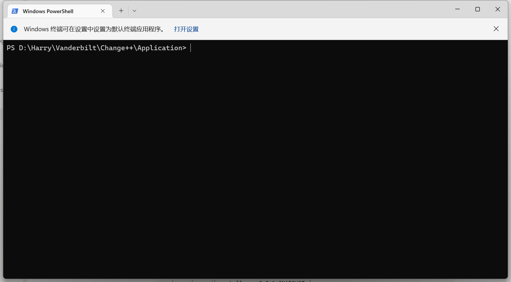

# Taylor Swift Lyric Guessing Game

# How to start the project?

Note: the project requires the installation of Git, Java JDK (18 or above) and NodeJS

1. Open a terminal and cd into a directory
    
    
    
2. Clone the project
    
    ```bash
    git clone https://github.com/ChangePlusPlusVandy/change-coding-challenge-2022-JiashuHarryHuang.git
    ```
    
3. cd into the project folder
    
    ```bash
    cd change-coding-challenge-2022-JiashuHarryHuang
    ```
    
4. To start the backend server, cd into the backend folder and initialize the Jar package
    
    ```bash
    cd backend
    ```
    
    ```bash
    java -jar coding_challenge-0.0.1-SNAPSHOT.jar
    ```
    
    - The terminal should look like this:
        
        
    - If there is an error, it might be because your JDK version is not updated
5. Now the backend server has started. Minimize the window and open another terminal at the project’s root location and cd into the frontend folder
    
    ```bash
    cd frontend
    ```
    
    
    
6. Run the the following command to install node modules
    
    ```bash
    npm install
    ```
    
7. Now you can start the project
    
    ```bash
    npm start
    ```
    
    - The terminal should look like this
        
        
        
8. If not already, open a browser and enter [http://localhost:3000/](http://localhost:3000/)
9. Enjoy the game!